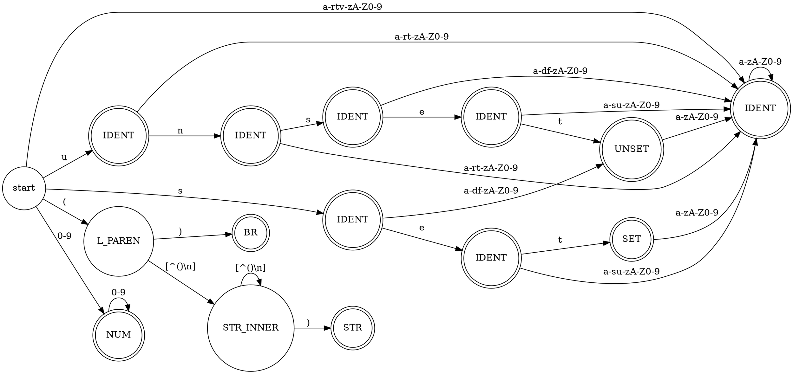

% Лабораторная работа № 1.4 «Лексический распознаватель»
% <лабораторная ещё не сдана>
% Кирилл Киселёв, ИУ9-61Б

# Цель работы

Целью данной работы является изучение использования 
детерминированных
конечных автоматов с размеченными
заключительными состояниями
(лексических распознавателей) для решения задачи
лексического анализа.

# Индивидуальный вариант

set, unset, (), строковые 
литералы начинаются с 
(, заканчиваются на ),
не могут содержать внутри круглые 
скобки и не могут пересекать границы строк текста.

# Реализация

Лексическая структура языка — регулярные выражения для доменов:

- SET = "set"
- UNSET = "unset"
- BRACKETS = "()"
- IDENT = [a-zA-Z][a-zA-Z0-9]*
- NUM = [0-9]+
- STR = ([a-zA-Z0-9 ]+)

Граф детерминированного распознавателя:



Реализация распознавателя:

Файл `lexer.go`

```go
package lexer

import (
	"fmt"
	"strconv"
	"unicode"
)

type Lexer struct {
	automata Automata
	program  []rune
	pos      [2]int
	cur      int
	recovery bool
}

func NewLexer(a Automata, program string) Lexer {
	return Lexer{
		automata: a,
		program:  []rune(program),
		pos:      [2]int{1, 1},
		cur:      0,
		recovery: false,
	}
}

func (l *Lexer) Next() Token {
	for {
		for l.cur < len(l.program) && unicode.IsSpace(l.program[l.cur]) {

			l.pos = l.updatePos(l.pos)
			l.cur += 1

		}

		if l.cur >= len(l.program) {
			return TokEOP{pos: [2]int{l.pos[0], l.pos[1]}}
		}

		idxStart := l.cur
		pos := l.pos
		lastFinalState := -1
		lastFinalIdx := -1
		attr := []rune{}
		currState := 0

		for l.cur < len(l.program) {

			currState = l.automata.MakeTransition(currState, l.program[l.cur])

			if l.automata.IsFinal(currState) {
				lastFinalState = currState
				lastFinalIdx = l.cur
			}

			if currState == -1 {
				break
			}

			pos = l.updatePos(pos)

			attr = append(attr, l.program[l.cur])

			l.cur += 1
		}

		if lastFinalState != -1 {
			l.recovery = false

			tokType, _ := l.automata.MarkupFunc(lastFinalState)
			l.cur = lastFinalIdx + 1

			start := l.pos
			l.pos = pos

			switch tokType {
			case SET:
				return TokSet{pos: start}
			case UNSET:
				return TokUnset{pos: start}
			case IDENT:
				return TokIdent{pos: start, value: string(attr)}
			case NUM:
				value, _ := strconv.ParseInt(string(attr), 10, 64)
				return TokNum{pos: start, value: value}
			case STR:
				return TokStr{pos: start, value: string(attr[1 : len(attr)-2])}
			case BRACKETS:
				return TokBrackets{pos: start}
			}
		} else {
			if !l.recovery {
				l.recovery = true
				fmt.Printf("SYNTAX ERROR at (%d, %d)\n", l.pos[0], l.pos[1])

			}
			l.cur = idxStart + 1
			l.pos = l.updatePos(l.pos)
			if l.program[l.cur] == '\n' {
				l.pos[0] -= 1
			}

			return l.Next()
		}
	}
}

func (l *Lexer) updatePos(pos [2]int) [2]int {
	if l.program[l.cur] == '\n' {
		pos[0] += 1
		pos[1] = 1
	} else {
		pos[1] += 1
	}
	return pos
}
```

Файл `table.go`

```go
package lexer

import (
	"unicode"
)

type Automata interface {
	MakeTransition(state int, c rune) int
	IsFinal(state int) bool
	MarkupFunc(state int) (Domain, bool)
}

type LexerAutomata struct {
	table       [15][11]int
	finalStates map[int]struct{}
	markupTable map[int]Domain
}

func NewAutomata() Automata {
	return &LexerAutomata{
		table: [15][11]int{
			/*                      s  e  t  u  n  (   )  Lt Nm   ' ',  Other        */
			/*     start state  */ {2, 8, 8, 1, 8, 9, -1, 8, 13, -1, -1},
			/*     state 1      */ {8, 8, 8, 8, 14, -1, -1, 8, 8, -1, -1},
			/*     state 2      */ {8, 3, 8, 8, 8, -1, -1, 8, 8, -1, -1},
			/*     state 3      */ {8, 8, 4, 8, 8, -1, -1, 8, 8, -1, -1},
			/*     state 4      */ {8, 8, 8, 8, 8, -1, -1, 8, 8, -1, -1},
			/*     state 5      */ {8, 6, 8, 8, 8, -1, -1, 8, 9, -1, -1},
			/*     state 6      */ {8, 8, 7, 8, 8, -1, -1, 8, 8, -1, -1},
			/*     state 7      */ {8, 8, 8, 8, 8, -1, -1, 8, 8, -1, -1},
			/*     state 8      */ {8, 8, 8, 8, 8, -1, -1, 8, 8, -1, -1},
			/*     state 9      */ {12, 12, 12, 12, 12, -1, 10, 12, 12, 12, -1},
			/*     state 10     */ {-1, -1, -1, -1, -1, -1, -1, -1, -1, -1, -1},
			/*     state 11     */ {-1, -1, -1, -1, -1, -1, -1, -1, -1, -1, -1},
			/*     state 12     */ {12, 12, 12, 12, -1, -1, 11, 12, 12, 12, -1},
			/*     state 13     */ {-1, -1, -1, -1, -1, -1, -1, -1, 13, -1, -1},
			/*     state 14     */ {5, 8, 8, 8, 8, -1, -1, 8, 8, -1, -1},
		},

		finalStates: map[int]struct{}{
			1:  {},
			2:  {},
			3:  {},
			4:  {},
			5:  {},
			6:  {},
			7:  {},
			8:  {},
			10: {},
			11: {},
			13: {},
			14: {},
		},
		markupTable: map[int]Domain{
			1:  IDENT,
			2:  IDENT,
			3:  IDENT,
			4:  SET,
			5:  IDENT,
			6:  IDENT,
			7:  UNSET,
			8:  IDENT,
			10: BRACKETS,
			11: STR,
			13: NUM,
			14: IDENT,
		},
	}
}

func (a *LexerAutomata) MakeTransition(state int, c rune) int {
	switch {
	case c == 's':
		return a.table[state][0]
	case c == 'e':
		return a.table[state][1]
	case c == 't':
		return a.table[state][2]
	case c == 'u':
		return a.table[state][3]
	case c == 'n':
		return a.table[state][4]
	case c == '(':
		return a.table[state][5]
	case c == ')':
		return a.table[state][6]
	case unicode.IsLetter(c):
		return a.table[state][7]
	case unicode.IsDigit(c):
		return a.table[state][8]
	case unicode.IsGraphic(c) && c != '\n' :
		return a.table[state][9]
	default:
		return a.table[state][10]
	}
}

func (a *LexerAutomata) IsFinal(state int) bool {
	_, ok := a.finalStates[state]

	return ok
}

func (a *LexerAutomata) MarkupFunc(state int) (Domain, bool) {
	tok, ok := a.markupTable[state]

	return tok, ok
}
```

Файл `token.go`

```go
package lexer

import "fmt"

type Domain int

const (
	SET Domain = iota
	UNSET
	BRACKETS
	IDENT
	NUM
	STR
	EOP
)

type Token interface {
	GetType() Domain
	GetPos() (int, int)
	String() string
}

// SET token

type TokSet struct {
	pos [2]int
}

func (t TokSet) GetPos() (int, int) {
	return t.pos[0], t.pos[1]
}

func (t TokSet) GetType() Domain {
	return SET
}

func (t TokSet) String() string {
	return fmt.Sprintf("%v (%d, %d)", SET, t.pos[0], t.pos[1])
}

// UNSET token

type TokUnset struct {
	pos [2]int
}

func (t TokUnset) GetPos() (int, int) {
	return t.pos[0], t.pos[1]
}

func (t TokUnset) GetType() Domain {
	return UNSET
}

func (t TokUnset) String() string {
	return fmt.Sprintf("%v (%d, %d)", t.GetType(), t.pos[0], t.pos[1])
}

// BRACKETS token

type TokBrackets struct {
	pos [2]int
}

func (t TokBrackets) GetPos() (int, int) {
	return t.pos[0], t.pos[1]
}

func (t TokBrackets) GetType() Domain {
	return BRACKETS
}

func (t TokBrackets) String() string {
	return fmt.Sprintf("%v (%d, %d)", t.GetType(), t.pos[0], t.pos[1])
}

// IDENT token

type TokIdent struct {
	value string
	pos   [2]int
}

func (t TokIdent) GetPos() (int, int) {
	return t.pos[0], t.pos[1]
}

func (t TokIdent) GetType() Domain {
	return IDENT
}

func (t TokIdent) String() string {
	return fmt.Sprintf("%s (%d, %d): %s", t.GetType(), t.pos[0], t.pos[1], t.value)
}

// NUM token

type TokNum struct {
	value int64
	pos   [2]int
}

func (t TokNum) GetPos() (int, int) {
	return t.pos[0], t.pos[1]
}

func (t TokNum) GetType() Domain {
	return NUM
}

func (t TokNum) String() string {
	return fmt.Sprintf("%s (%d, %d): %d", t.GetType(), t.pos[0], t.pos[1], t.value)
}

// STR token

type TokStr struct {
	value string
	pos   [2]int
}

func (t TokStr) GetPos() (int, int) {
	return t.pos[0], t.pos[1]
}

func (t TokStr) GetType() Domain {
	return STR
}

func (t TokStr) String() string {
	return fmt.Sprintf("%s (%d, %d): %s", t.GetType(), t.pos[0], t.pos[1], t.value)
}

// EOP token

type TokEOP struct {
	pos [2]int
}

func (t TokEOP) GetPos() (int, int) {
	return t.pos[0], t.pos[1]
}

func (t TokEOP) GetType() Domain {
	return EOP
}

func (t TokEOP) String() string {
	return fmt.Sprintf("%s (%d, %d)", t.GetType(), t.pos[0], t.pos[1])
}

func (t Domain) String() string {
	switch t {
	case NUM:
		return "NUM"
	case IDENT:
		return "IDENT"
	case SET:
		return "SET"
	case UNSET:
		return "UNSET"
	case BRACKETS:
		return "BRACKETS"
	case STR:
		return "STR"
	case EOP:
		return "EOP"
	}

	return ""
}
```

# Тестирование

Входные данные

```
set ( \ unset abc123 (abcd \t fd a f)
() unset (1234


(!@#$%^&*)
```

Вывод на `stdout`

```
SET (1, 1)
SYNTAX ERROR at (1, 5)
UNSET (1, 9)
IDENT (1, 15): abc123
STR (1, 22): abcd \t fd a 
BRACKETS (2, 1)
UNSET (2, 4)
SYNTAX ERROR at (2, 10)
NUM (2, 11): 1234
STR (5, 1): !@#$%^&
EOP (6, 1)
```

# Вывод

В ходе выполнения лабораторной работы были
получены навыки по разработке
лексического анализатора с применением 
детерминированного
конечного автомата с размеченными
заключительными состояниями. Для выполнения ЛР
был построен детерминированный автомат
для заданного языка
и реализован залексический анализатор на языке Golang

