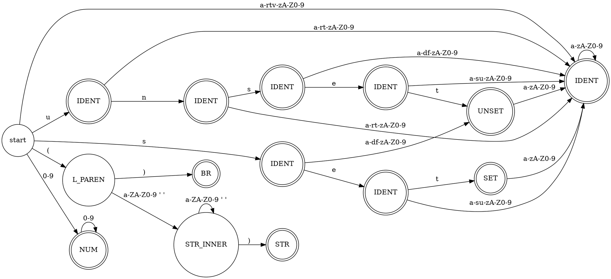

% Лабораторная работа № 1.4 «Лексический распознаватель»
% <лабораторная ещё не сдана>
% Кирилл Киселёв, ИУ9-61Б

# Цель работы

‹переписываете цель работы из задания›

# Индивидуальный вариант

‹переписываете индивидуальный вариант›

# Реализация

Лексическая структура языка — регулярные выражения для доменов:

- …
- …

Граф недетерминированного распознавателя:

```dot
…
```

Граф детерминированного распознавателя:



Реализация распознавателя:

```java
…
```

# Тестирование

Входные данные

```
…
```

Вывод на `stdout`

```
…
```

# Вывод

‹пишете, чему научились›
